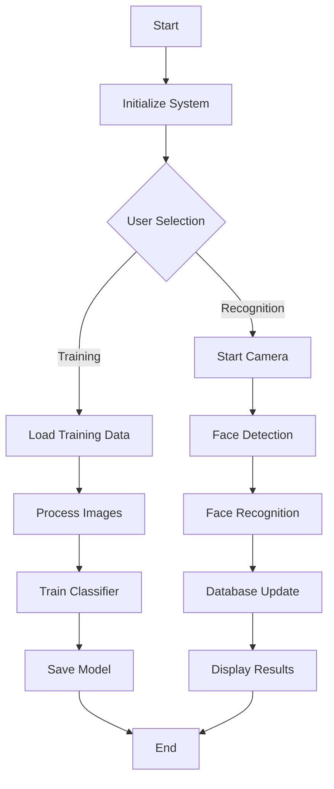

# 👤 Face Recognition System

A comprehensive face recognition system built with Python, OpenCV, and Tkinter that allows for face detection, training, and recognition.

## 🌟 Features

- 🔍 Face Detection and Recognition
- 📚 Training Data Management
- 🖥️ User-friendly GUI Interface
- ⚡ Real-time Face Recognition
- 💾 Database Integration (MySQL)
- 👥 Multiple User Support
- 📊 Attendance Tracking
- 🔒 Secure Authentication

## 🛠️ Prerequisites

Before running this project, make sure you have the following installed:

- 🐍 Python 3.x
- 📸 OpenCV (`cv2`)
- 🖼️ PIL (Python Imaging Library)
- 🗄️ MySQL Connector
- 🎯 Tkinter (usually comes with Python)

## 📥 Installation

1. Clone the repository:
```bash
git clone <repository-url>
```

2. Install the required packages:
```bash
pip install opencv-python
pip install pillow
pip install mysql-connector-python
```

3. Set up your MySQL database and update the connection details in the code.

## 📁 Project Structure

```
Face Recognition System/
├── Data/                  # Directory for storing face images
├── college_images/        # Directory for UI images
├── train.py              # Training module
├── face_recognition.py   # Main recognition module
├── face_detector.py      # Face detection module
└── README.md
```

## 🔄 System Flow Diagram



## 🚀 Usage

### Training the System

1. Run the training module:
```bash
python train.py
```

2. Click on the "TRAIN DATA" button to start the training process
3. The system will process all images in the Data directory and create a classifier

### Face Recognition

1. Run the main application:
```bash
python face_recognition.py
```

2. Use the interface to:
   - 📸 Capture new face images
   - 🎓 Train the system
   - 🔍 Perform face recognition
   - 📊 View attendance records

## 💾 Database Setup

1. Create a MySQL database
2. Update the database connection details in the code
3. The system will automatically create necessary tables

### Database Schema

```sql
CREATE TABLE student (
    student_id INT PRIMARY KEY,
    name VARCHAR(100),
    roll_no VARCHAR(20),
    department VARCHAR(50),
    face_id INT
);

CREATE TABLE attendance (
    attendance_id INT PRIMARY KEY AUTO_INCREMENT,
    student_id INT,
    date DATE,
    time TIME,
    status VARCHAR(20),
    FOREIGN KEY (student_id) REFERENCES student(student_id)
);
```

## 🔧 Technical Details

### Face Detection Process
1. Image Capture
2. Grayscale Conversion
3. Face Detection using Haar Cascade
4. Face Region Extraction

### Recognition Algorithm
- LBPH (Local Binary Pattern Histogram) Face Recognition
- Feature Extraction
- Pattern Matching
- Confidence Score Calculation

## 🤝 Contributing

Contributions are welcome! Please feel free to submit a Pull Request.

## 📄 License

This project is licensed under the MIT License - see the LICENSE file for details.

## 🙏 Acknowledgments

- OpenCV for face detection and recognition capabilities
- MySQL for database management
- Tkinter for GUI development

## ❓ Support

For support, please open an issue in the repository or contact the maintainers.

## 📞 Contact

- 📧 Email: rohitbansal.dev@gmail.com
- 🌐 Website: your-website.com

## 📝 Version History

- v1.0.0 - Initial Release
- v1.1.0 - Added Attendance Tracking
- v1.2.0 - Enhanced UI/UX
- v1.3.0 - Added Real-time Recognition

## 🔒 Security Considerations

- Secure storage of face data
- Encrypted database connections
- Access control implementation
- Regular security updates

## 🌐 System Requirements

- Windows 10/11 or Linux
- 4GB RAM minimum
- 2GB free disk space
- Webcam with 720p resolution minimum
